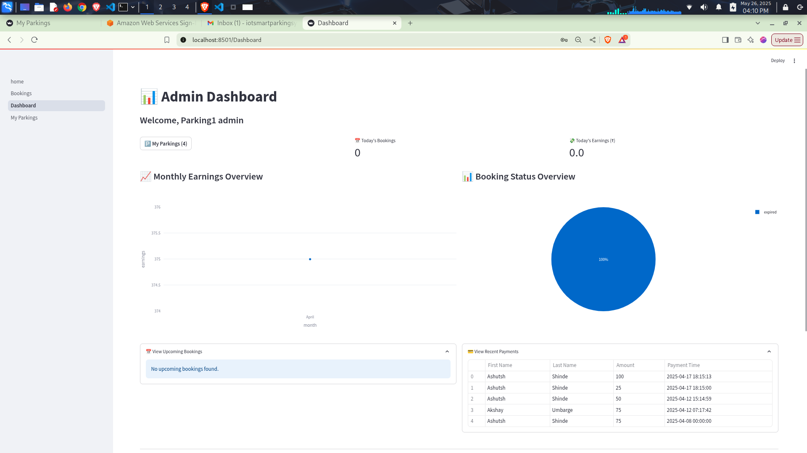
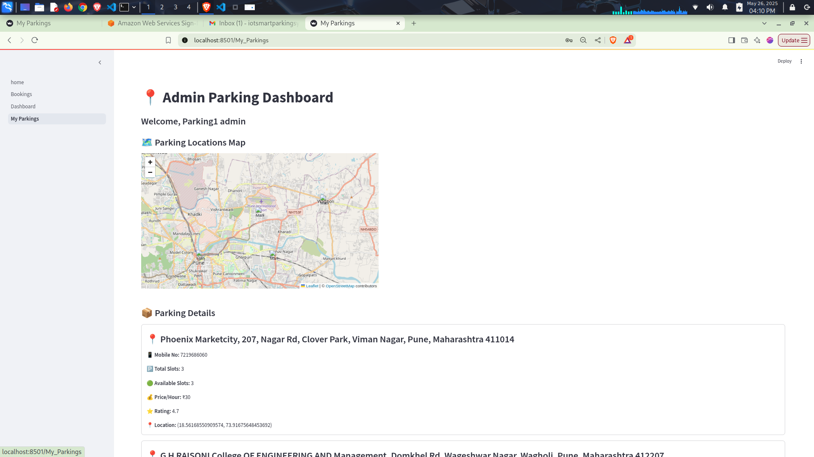
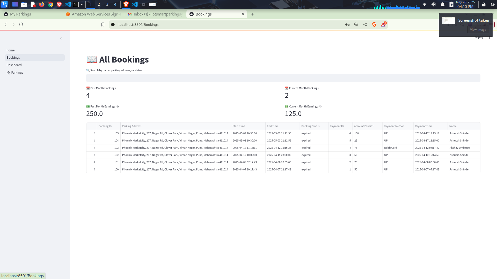

# 🧠 Admin Dashboard – Smart Parking System

The **Admin Dashboard** is a key component of the Smart Parking System. Built using **Streamlit**, it allows parking administrators to monitor real-time parking status, manage bookings, visualize analytics, and control entry gates through a user-friendly interface.

---

## 🚀 Getting Started

> ⚠️ **Note:** Make sure that both the ESP32 (Arduino) device and the Admin Dashboard are connected to the **same local network** to enable proper communication via the MQTT Broker.


### 🛠️ Prerequisites

Ensure you have the following installed:

* Python 3.8+
* pip (Python package manager)
* MySQL Server (for storing slot and booking data)
* MQTT Broker (e.g., Mosquitto for device communication)
* Streamlit

---

## 📦 Installation Steps

1. **Navigate to the folder**

   ```bash
   cd Admin_Dashboard
   ```

2. **(Optional) Create and activate a virtual environment**

   ```bash
   python3 -m venv venv
   source venv/bin/activate  # Linux/macOS
   .\venv\Scripts\activate   # Windows
   ```

3. **Install dependencies**

   ```bash
   pip install -r requirements.txt
   ```

4. **Run the Streamlit app**

   ```bash
   streamlit run dashboard.py
   ```

---

## 🧰 Features

* 📍 **Map View**
  Displays parking locations using latitude and longitude on an interactive map.

* 📊 **Analytics Dashboard**
  Real-time charts and metrics for slot usage, booking history, and traffic trends.

* 🔐 **Gate Control Integration**
  Admins can open/close gates based on booking status or slot availability.

* 📾 **Booking View**
  Check active, upcoming, or expired bookings for each parking slot.

* 🧑‍💼 **Admin Filtering**
  Filter data by admin ID to manage only assigned parking lots.

---

## 🏗️ System Architecture

```
[ IR Sensors ] → [ ESP32 NodeMCU ] → [ MQTT Broker ]
                                         ↓
                              [ Streamlit Admin Dashboard ]
                                         ↓
                              [ Django Server + MySQL DB ]
```

---

## 🖼️ Screenshots

> Place your screenshots in the `assets/` folder and reference them here.

### 📍 Dashboard Interface



### 🗾️ Map View with Slot Filters



### 📍 Bookings Interface


---

## 🔌 MQTT Integration

* The ESP32 sends slot and gate data to the MQTT Broker.
* The dashboard subscribes to relevant topics and updates slot status in real time.
* Slot data is stored and retrieved from a MySQL database.

---

## 🗽️ Admin Filtering

* Admins can view:

  * Only the parkings assigned to them.
  * Specific slots by location, status, or booking.
* This helps in delegation and multi-admin scalability.

---

## 📋 requirements.txt

```text
streamlit
paho-mqtt
mysql-connector-python
pandas
geopandas
matplotlib
plotly
```

---

## ❓ Troubleshooting

* **Streamlit not found?**
  Run: `pip install streamlit`

* **Can't connect to MySQL?**
  Check your DB credentials in the config file or `.env`.

* **No MQTT messages?**
  Ensure the broker is running and topics are correctly subscribed.
