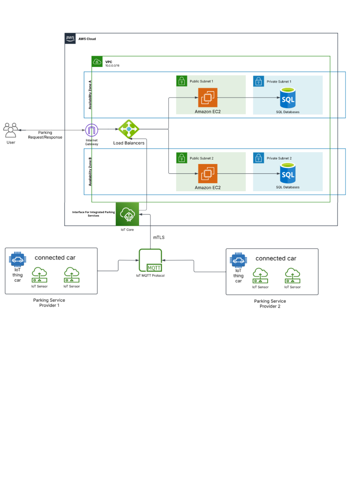

# 🚗 STREAMPARK: IOT AND CLOUD FRAMEWORK FOR EFFICIENT PARKING SPACE UTILIZATION

This repository contains a complete implementation of a **Smart Parking System**, including an Admin Dashboard, User Dashboard, Arduino Code, and MySQL database schema. The system leverages **IoT + Web + MQTT** to manage parking availability, booking, and gate access in real time.

---

## 📁 Repository Structure

```bash
SmartParkingSystem/
├── Admin_Dashboard/        # Streamlit-based dashboard for admins
├── Arduino_Code/           # ESP32 code to control IR sensors & servo gate
├── User_Dashboard/         # Django-based portal for users to book slots
├── SmartParkingSys.sql     # MySQL dump of the database schema
└── README.md               # Project overview and instructions
```

---

## 🧠 System Overview

### ☁️ AWS Cloud Deployment

This system is deployed using **Amazon Web Services (AWS)** with an architecture built for high availability, fault tolerance, and secure resource management. Key AWS services used:

* **Amazon VPC (Virtual Private Cloud):** Provides an isolated cloud environment with separate public and private subnets.
* **Subnets:**

  * Public subnets host EC2 instances running Django and Streamlit apps.
  * Private subnets are used for RDS (MySQL) databases with no direct internet access.
* **Security Groups & NACLs:** Control traffic between resources securely.
* **Internet Gateway & NAT Gateway:** Manage public and outbound traffic securely from EC2 and RDS.
* **EC2 (Elastic Compute Cloud):** Hosts the web applications.
* **RDS (Relational Database Service):** Manages MySQL database instances with automated backups.
* **Route 53:** Provides DNS management and health monitoring.
* **Elastic Load Balancer (ALB):** Routes user requests across multiple EC2 instances in different regions for load balancing.
* **IAM Roles:** Manage fine-grained access permissions for AWS services.

> 🧠 Using VPC and its services ensures a scalable, secure, and organized cloud infrastructure across different availability zones (AZs).

The Smart Parking System is fully deployed on **Amazon Web Services (AWS)** to ensure scalability, availability, and security:

* **AWS EC2 Instances** host Django and Streamlit applications in public subnets.
* **RDS (MySQL)** is used in private subnets for secure and scalable data storage.
* **Application Load Balancer (ALB)** distributes traffic across regional servers.
* **Route 53** integrates domain name services and monitors endpoint health.
* **Security Groups & IAM Roles** manage secure access and permissions.
* **Multiple Availability Zones (AZs)** ensure regional redundancy and high availability.

> 🚀 This cloud-based architecture enables elastic scaling, global access, and fault-tolerant performance under real-world load.

### ☁️ Cloud Architecture

This Smart Parking System is deployed using a scalable and secure cloud architecture:

* **Public Subnet:** Hosts web servers (Django + Streamlit) across multiple AWS regions.
* **Private Subnet:** Hosts MySQL databases isolated for security.
* **Load Balancer (Application Load Balancer):** Ensures high availability by routing traffic to the least-loaded web server.
* **Route 53 (DNS):** Handles domain name resolution and health checks.
* **Security Groups:** Strict access control between devices, public and private resources.



> ✅ This setup ensures **high availability**, **fault tolerance**, and **geographic redundancy** across cloud regions.

### 🛜 Architecture

```text
[ IR Sensors ] → [ ESP32 NodeMCU ] → [ MQTT Broker ]
                                  ↓
                          [ Django Server + MySQL DB ]
                                  ↓
           [ Streamlit Admin Dashboard | User Django Portal ]
```

> ⚠️ **Note:** Ensure the ESP32 device and Admin Dashboard are connected to the **same local network** for MQTT communication.

---

## 🛠️ Technologies Used

| Layer       | Tech Used                  |
| ----------- | -------------------------- |
| IoT Device  | ESP32 + IR Sensors + Servo |
| Messaging   | MQTT (Mosquitto)           |
| Backend     | Django (Python)            |
| Admin Panel | Streamlit                  |
| Database    | MySQL                      |
| Hosting     | AWS EC2 (optional)         |

---

## 📦 Installation Guide

### 1. Arduino Code Setup

* Navigate to `Arduino_Code/`
* Open the `.ino` file in Arduino IDE
* Update Wi-Fi credentials and MQTT broker IP
* Upload to ESP32 board

### 2. Admin Dashboard (Streamlit)

* Go to `Admin_Dashboard/`
* Create a virtual environment and install requirements:

```bash
cd Admin_Dashboard
pip install -r requirements.txt
streamlit run dashboard.py
```

### 3. User Dashboard (Django)

* Navigate to `User_Dashboard/`
* Install Python requirements and run server:

```bash
cd User_Dashboard
pip install -r requirements.txt
python manage.py migrate
python manage.py runserver
```

### 4. Database Setup

#### 🐧 MySQL Setup on Linux

```bash
sudo apt update
sudo apt install mysql-server
sudo systemctl start mysql
sudo mysql_secure_installation
```

#### 🗃️ Import Database Schema

* Log in to MySQL:

```bash
mysql -u root -p
```

* Create a new database:

```sql
CREATE DATABASE smart_parking;
USE smart_parking;
SOURCE SmartParkingSys.sql;
```

---

## 🔍 Key Features

### Admin Dashboard

* Monitor parking slots live on a map
* Control gate via MQTT
* Filter by location, availability, or admin ID
* Booking analytics & usage charts

### User Dashboard

* User login/registration
* View available slots
* Book a slot & receive QR code
* Check booking status/history

### Arduino System

* Detects car presence via IR sensors
* Sends status via MQTT
* Receives gate control commands
* Controls servo motor for gate opening/closing

---

## 🎥 Demo Video

> 🎬 Watch the full system demo on YouTube. This video demonstrates the full working of the Smart Parking System from device to dashboards. https://www.youtube.com/watch?v=gOFd1jHfPcI

---

## 🧑‍💼 Author

**Ashutosh Shinde**
📧 [ashutoshshinde1301@gmail.com](mailto:ashutoshshinde1301@gmail.com)
🔗 [LinkedIn](https://in.linkedin.com/in/ashutoshshinde01)

---
